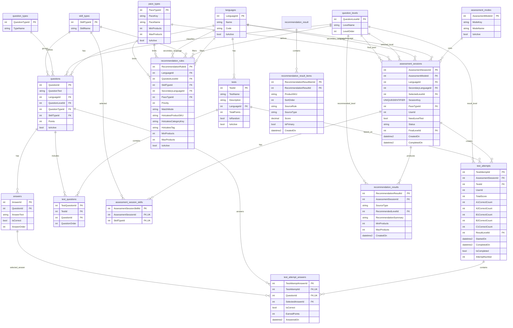

# Adatbázis terv 0.1

```mermaid
erDiagram

languages{
    int LanguageId PK
    string Name
    string Code
    bool IsActive
}

question_levels{
    int QuestionLevelId PK
    string LevelName
    int LevelOrder
}

question_types{
    int QuestionTypeId PK
    string TypeName
}

skill_types {
    int SkillTypeId PK
    string SkillName
}

questions{
    int QuestionId PK
    string QuestionText
    int LanguageId FK
    int QuestionLevelId FK
    int QuestionTypeId FK
    int SkillTypeId FK
    int Points
    bool IsActive
}

answers{
    int AnswerId PK
    int QuestionId FK
    string AnswerText
    bool IsCorrect
    int AnswerOrder
}

tests{
    int TestId PK
    string TestName
    string Description
    int LanguageId FK
    int TotalPoints
    bool IsRandom
    bool IsActive
}

test_questions{
    int TestQuestionId PK
    int TestId FK
    int QuestionId FK
    int QuestionOrder
}

recommendation_rules {
    int RecommendationRuleId PK
    int LanguageId FK
    int QuestionLevelId FK
    int SkillTypeId FK
    int SecondaryLanguageId FK
    int PaceTypeId FK
    int Priority
    string MatchMode
    string HotcakesProductSKU
    string HotcakesCategoryKey
    string HotcakesTag
    int MinProducts
    int MaxProducts
    bool IsActive
}

%% Új táblák

assessment_modes{
    int AssessmentModeId PK
    string ModeKey
    string ModeName
    bool IsActive
}
pace_types{
    int PaceTypeId PK
    string PaceKey
    string PaceName
    int MinProducts
    int MaxProducts
    bool IsActive
}
assessment_sessions{
    int AssessmentSessionId PK
    int AssessmentModeId FK
    int LanguageId FK
    int SecondaryLanguageId FK
    int SelectedLevelId FK
    UNIQUEIDENTIFIER SessionKey
    int PaceTypeId FK
    int UserId
    bool NeedLevelTest
    string Status
    int FinalLevelId FK
    datetime2 CreatedOn
    datetime2 CompletedOn
}

assessment_session_skills{
    int AssessmentSessionSkillId PK
    int AssessmentSessionId FK, UK
    int SkillTypeId FK,  UK
}

test_attempts{
    int TestAttemptId PK
    int AssessmentSessionId FK
    int TestId FK
    int UserId 
    int TotalScore
    int A1CorrectCount
    int A2CorrectCount
    int B1CorrectCount
    int B2CorrectCount
    int C1CorrectCount
    int ResultLevelId FK
    datetime2 StartedOn
    datetime2 CompletedOn
    bool IsCompleted
    int AttemptNumber

}

test_attempt_answers{
    int TestAttemptAnswerId PK
    int TestAttemptId FK, UK
    int QuestionId FK, UK
    int SelectedAnswerId FK
    bool IsCorrect
    int EarnedPoints
    datetime2 AnsweredOn 
}
recommendation_results{
    int RecommendationResultId PK
    int AssessmentSessionId FK 
    string SourceType
    int RecommendedLevelId FK
    string RecommendationSummary
    int MinProducts
    int MaxProducts
    datetime2 CreatedOn
}

%%Plusz táblák
recommendation_result_items {
    int RecommendationResultItemId PK
    int RecommendationResultId FK
    string ProductSKU
    int SortOrder
    string SourceRule
    string SourceType
    decimal Score
    bool IsPrimary
    datetime2 CreatedOn
}

%% Az eddigi kapcsolatok
languages ||--o{ questions : has
question_levels ||--o{ questions : classifies
question_types ||--o{ questions : defines
skill_types ||--o{ questions : groups

questions ||--o{ answers : has

languages ||--o{ tests : has
tests ||--o{ test_questions : contains
questions ||--o{ test_questions : includes

languages ||--o{ recommendation_rules : filters
question_levels ||--o{ recommendation_rules : filters
skill_types ||--o{ recommendation_rules : filters
languages ||--o{ recommendation_rules : secondary_language
pace_types ||--o{ recommendation_rules : limits


%% Új kapcsolatok

assessment_modes ||--o{ assessment_sessions : uses

languages ||--o{ assessment_sessions : target_language
languages ||--o{ assessment_sessions : secondary_language

question_levels ||--o{ assessment_sessions : selected_level

pace_types ||--o{ assessment_sessions : defines
pace_types ||--o{ recommendation_rules : limits

assessment_sessions ||--o{ assessment_session_skills : has
skill_types ||--o{ assessment_session_skills : selected

assessment_sessions ||--o{ test_attempts : creates
tests ||--o{ test_attempts : based_on
question_levels ||--o{ test_attempts : result_level

test_attempts ||--o{ test_attempt_answers : contains
questions ||--o{ test_attempt_answers : answers
answers ||--o{ test_attempt_answers : selected_answer

assessment_sessions ||--o{ recommendation_results : produces
question_levels ||--o{ recommendation_results : recommended_level
question_levels ||--o{ assessment_sessions : final_level


%%Plusz kapcsolatok
recommendation_result ||--o{ recommendation_result_items : contains

```